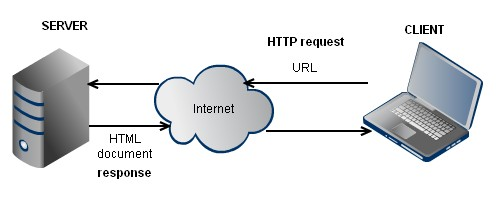
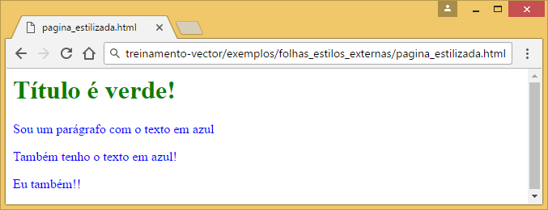
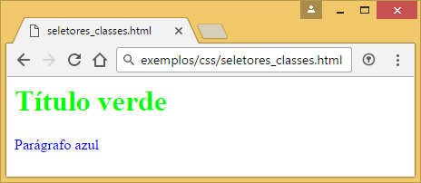
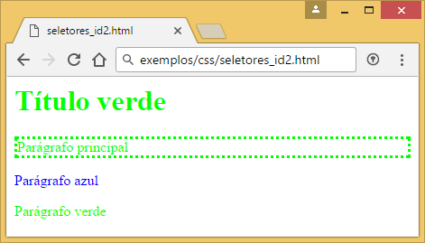
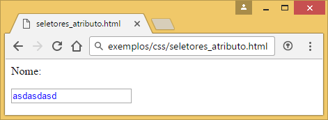
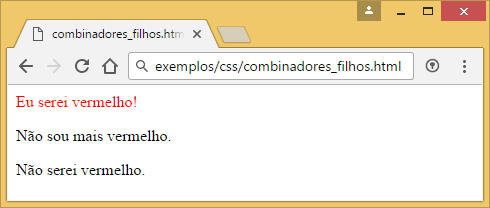
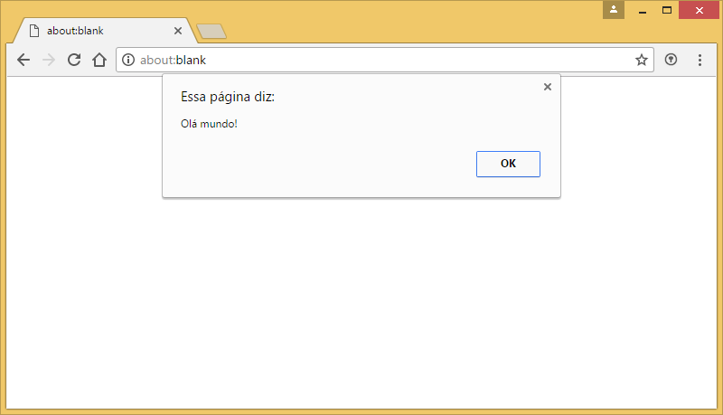
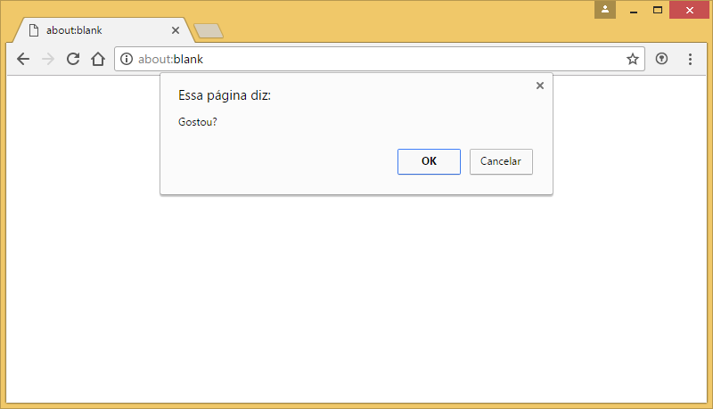
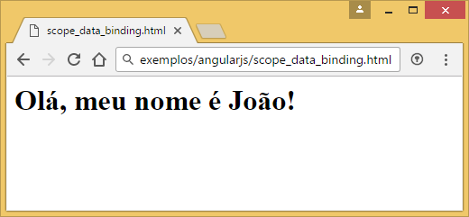

# World Wide Web

## Surgimento

A *World Wide Web*, também conhecida como *WWW* ou apenas *web*, foi criada para exibição de documentos em hipermídia interligados na internet, a fim de tornar mais fácil o compartilhamento de documentos de pesquisas.

O primeiro site é o hoje disponibilizado no endereço: http://info.cern.ch/hypertext/WWW/TheProject.html

Nesse site é possível obter diversas informações sobre o seu surgimento.

Há inúmeras referências na sua base, código e documentação sobre a sua real intenção no desenvolvimento mesmo esta ter mudado drasticamente nos seus anos de existência.

Site da Microsoft em 1994:


## Como funciona

Para exibir uma página de internet é necessário um navegador compatível o qual realizará uma requisição web e exibirá o retorno para o usuário.

Um site é hospedado em um servidor HTTP (protocolo comumente usado para fornecimento de conteúdo na internet, geralmente páginas em HTML).

A grosso modo, o usuário digita um endereço no navegador e este envia uma requisição ao servidor onde o site está hospedado. O servidor processa essa informação e retorna o conteúdo requisitado. O navegador recebendo essa informação, renderiza o documento e o exibe ao usuário.

Ilustração de uma requisição web:



## WEB 2.0 e SPAs

### Páginas dinâmicas

Até então, os documentos exibidos na internet eram apenas páginas estáticas e não era possível ter seu conteúdo alterado dinamicamente.

Embora essas páginas suprissem a necessidade do momento, com o passar do tempo fomos tendo a necessidade de páginas mais ricas, dinâmicas e interativas. Criando um conceito hoje chamado de WEB 2.0.

### Web 2.0

Web 2.0 foi um termo popularizado pela O'Reilly Media, uma companhia de mídia americana, para conceitualizar a *web como plataforma*.

### Single Page Applications

Com o rápido crescimento da web e a grande quantidade de aplicações sendo desenvolvidas para essa plataforma, a complexidade dessas aplicações foi aumentando.

A fim de se aproximar de uma aplicação desktop, foi criado o conceito de *Single Page App*, ou apenas *SPA*.

Como o próprio nome diz, SPA é basicamente uma aplicação que tem apenas uma página de entrada. Dessa forma o usuário não precisa esperar a aplicação recarregar a página inteira após cada interação, assim melhorando a experiência do usuário, performance e, por conta de aspectos tecnológicos, facilidade de manutenção.

O Google foi um dos pioneiros nesse conceito, tendo o Gmail como seu carro chefe.

Ilustração do Gmail:


## Camadas

Uma página web é basicamente divida em 3 camadas: exibição, estilo e comportamento.

*HTML* é a linguagem usada para definir a estrutura da página, contendo a informação propriamente dita.

*CSS* é usada para definir o estilo da página, como tamanho das fontes, cores, etc.

*JavaScript* é responsável pela parte comportamental.

# HyperText Markup Language

## Introdução

Assim como a XML (usada para estrutura de dados, comunicação, entre outros), a *HTML* é derivada da SGML (Standard Generalized Markup Language).

Sua estrutura é composta por *tags* (marcadores), delimitadas pelos sinais de menor `<` e maior `>`.

Exemplo de um parágrafo em HTML:

```xml
<p>Um parágrafo em HTML é representado pela tag *p*.</p>
```

## Estrutura

Uma página HTML é composta de cabeçalho e corpo, sendo representados pelas palavras `head` e `body`, respectivamente.

No cabeçalho vão informações como o título e outras informações usadas pelos navegadores.

No corpo vai o documento visto pelo usuário. Nele é possível definir toda a estrutura a ser exibida, tal qual as informações nela contidas.

Exemplo de uma página HTML:

```xml
<html>
    <head>
        <title>Título da página</title>
    </head>
    <body>
        <h1>Título exibido no corpo da página</h1>
        <p>Um parágrafo</p>
    </body>
</html>
```

O exemplo acima será renderizado como a seguir:


## Elementos e tags existentes

Essas são os elementos e suas tags HTML suportados pelos navegadores atuais:

| Nome | Significado |
|--------|--------|
| `<a>` | 	Âncora: usado para ligar a outro recurso web |
| `<abbr>` | 	Abreviação |
| `<address>` | 	Endereço |
| `<area>` | 	Área |
| `<article>` | 	Elemento artigo |
| `<aside>` | 	Elemento à parte |
| `<audio>` | 	Conteúdo de som |
| `<b>` | 	Texto em negrito |
| `<base>` | 	Elemento base |
| `<bdo>` | 	Representa explicitamente a direção do texto |
| `<blockquote>` | 	Bloco de citação |
| `<body>` | 	Corpo da página |
| `<br>` | 	Insere uma quebra de linha |
| `<button>` | 	Botão |
| `<canvas>` | 	Utilizado para a renderização de gráficos |
| `<caption>` | 	Legenda da tabela |
| `<cite>` | 	Citação |
| `<code>` | 	Texto de código computacional |
| `<col>` |  Coluna |
| `<colgroup>` | Grupo de colunas |
| `<command>` | Botão de comando |
| `<datalist>` | Lista suspensa |
| `<dd>` | Definição da descrição |
| `<del>` | Texto suprimido |
| `<details>` | Detalhes |
| `<div>` | Bloco de documento |
| `<dl>` | 	Lista de definição |
| `<dt>` | 	Termo de definição |
| `<em>` | 	Texto enfatizado |
| `<embed>` | Elemento embutido |
| `<fieldset>` | Grupo de campos |
| `<figcaption>` | Legenda de uma figura |
| `<figure>` | 	Figura |
| `<footer>` | 	Rodapé da página |
| `<form>` | 	Formulário |
| `<h1>` à `<h6>` |	Títulos, onde o valor 1 representa um título maior do que o valor 6 |
| `<head>` | 	Cabeçalho principal do documento |
| `<header>` | 	Cabeçalho principal da página |
| `<hgroup>` | 	Grupo de títulos |
| `<hr>` | 	Linha horizontal |
| `<html>` | 	Raiz de um documento HTML |
| `<i>` | 	Texto em itálico |
| `<iframe>` | 	Janela de navegação aninhada |
| `` | 	Inclui um imagem |
| `<input>` | 	Campo de entrada |
| `<ins>` | 	Texto inserido |
| `<kbd>` | 	Texto do teclado |
| `<label>` | 	Etiqueta |
| `<legend>` | 	Título de um grupo de controles formulário |
| `<li>` | 	Item de uma lista |
| `<link>` | 	Link de recursos |
| `<map>` | 	Mapa de imagens |
| `<mark>` | 	Marcação |
| `<menu>` | 	Menu de comandos |
| `<meta>` | 	Define um meta-informação |
| `<meter>` | 	Elemento de medida |
| `<nav>` | 	Elemento de navegação |
| `<noscript>` | 	Exibido se scripts estiver desativados |
| `<object>` | 	Objeto incorporado |
| `<ol>` | 	Lista ordenada |
| `<optgroup>` | 	Grupo de opções |
| `<option>` | 	Opção |
| `<output>` | 	Resultado/saída de um cálculo |
| `<p>` | 	Parágrafo |
| `<param>` | 	Define parâmetro de plugins invocados pelos elementos object, não representando nada por si só |
| `<pre>` | 	Texto pré-formatado |
| `<progress>` | 	Progresso da conclusão de uma ação, como por exemplo um download |
| `<q>` | 	Breve citação |
| `<ruby>` | 	Anotação ruby |
| `<rp>` | 	Parenteses de texto ruby |
| `<rt>` | 	Componentes de texto ruby |
| `<samp>` | 	Amostra de programa ou sistema de computação |
| `<script>` | 	Representa um script |
| `<section>` | 	Seção do documento |
| `<select>` | 	Lista selecionável |
| `<small>` | 	Texto pequeno |
| `<source>` | 	Permite indicar diversas fontes para elentos de midia |
| `<span>` | 	Utilizado para um elemento dentro do fluxo de texto |
| `<strong>` | 	Texto grande |
| `<style>` | 	Define um estilo |
| `<sub>` | 	Texto com subscrição |
| `<sup>` | 	Texto sobrescrito |
| `<tbody>` | 	Corpo da tabela |
| `<td>` | 	Célula da tabela |
| `<textarea>` | 	Área de texto |
| `<tfoot>` | 	Rodapé da tabela |
| `<th>` | 	Célula de cabeçalho da tabela |
| `<thead>` | 	Representa o cabeçalho da tabela |
| `<time>` | 	Indica horas |
| `<title>` | 	Título da pagina |
| `<tr>` | 	Linha da tabela |
| `<ul>` | 	Lista não ordenada |
| `<var>` | 	Variável |
| `<video>` | 	Elemento de vídeo ou filme |

## Comentários

Às vezes é necessário colocarmos algum tipo de explicação no código, a fim deste ser facilmente entendido por outra pessoa.

Em HTML, um comentário é iniciado com `<!--` e finalizado com `-->`. Tudo entre essas tags será tratado como comentário, ou seja, não será renderizado pelo navegador.

Exemplo de comentário:

```xml
<!-- Aqui vai um comentário -->
```

## HTML5


### Surgimento

Em 2004, o WHATWG (Web Hypertext Application Technology Working Group) começou a trabalhar em um novo padrão HTML, enquanto a W3C (World Wide Web Consortium) concentrava seus esforços no XHTML. Mas em 2009 os dois grupos se uniram e trabalharam juntos no desenvolvimento do HTML5.

Com o crescimento de dispositivos móveis, como o iPhone, e a morte do Flash, o HTML5 foi ganhando força até tomar conta do mercado e obter suporte em todos os navegadores atuais. Substituindo assim a necessidade de qualquer plugin de terceiros para a criação de páginas web ricas em conteúdo e até mesmo animações.

### DOCTYPE

DOCTYPE é uma tag usada para informar ao navegador a versão de HTML na página em questão.

Essa tag deve estar obrigatoriamente acima da tag de início da página, html.
A declaração da DOCTYPE no HTML5 é extremamente simples, diferentemente de como era antes.

Exemplo de DOCTYPE antes do HTML5:

```xml
<!DOCTYPE HTML PUBLIC "-//W3C//DTD HTML 4.01//EN" "http://www.w3.org/TR/html4/strict.dtd">
```

DOCTYPE em HTML5:

```xml
<!DOCTYPE html>
```

### HTML Semântico

Antes do HTML5, tentávamos identificar as partes de um documento usando classes de CSS ou IDs fáceis de identificar.

Exemplo:

```xml
<body>

  <div id="cabecalho">
    <!-- Conteúdo do cabeçalho -->
  </div>

  <div class="secao" id="principal">
    <!-- Conteúdo principal -->
  </div>

  <div class="secao" id="destaques">
    <!-- Painéis com destaques -->
  </div>

  <div id="rodape">
    <!-- Conteúdo do rodapé -->
  </div>

</body>
```

Agora com essa *nova* versão de HTML, podemos utilizar novas tags que podem identificar cada parte da página.

Exemplo:

```xml
<body>

  <header>
    <!-- Conteúdo do cabeçalho -->
  </header>

  <section id="principal">
    <!-- Conteúdo principal -->
  </section>

  <section id="destaques">
    <!-- Painéis com destaques -->
  </section>

  <footer>
    <!-- Conteúdo do rodapé -->
  </footer>

</body>
```

Essas novas tags não trazem nenhuma diferença no visual, apenas carregarem um significado semântico atrelado à elas.

Com isso algum leitor de tela, por exemplo, é capaz de ler o código e identificar as partes julgadas importantes por ele.

Os motores de busca também podem utilizar esse código semântico para buscar e mostrar ao usuário o conteúdo de seu real interesse mais facilmente.

As *divs* não deixarão de existir pois ainda cumprem bem seu papel, mas não são mais necessárias para identificar a estrutura semântica da página.

Para explicar todo esse conceito o WHATWG fez um documento sobre o assunto. O qual pode ser conferido no seguinte endereço: https://html.spec.whatwg.org/multipage/semantics.html

# Cascading Style Sheets

## Introdução

CSS, sua sigla, foi proposta por *[Håkon Wium Lie](https://en.wikipedia.org/wiki/H%C3%A5kon_Wium_Lie)* em 1994 e publicamente lançada em 1996.

Foi desenvolvida com a intenção de prover *folhas de estilo* para a web, mas demorou a emplacar e apenas em 2000 o primeiro na navegador com **total suporte** à CSS1 foi lançado, *Internet Explorer 5.0*.

Apesar de ter demorado para ser largamente utilizada, hoje é essencial para qualquer página na web e já está na sua terceira versão.

Hoje, a linguagem em si não é mais baseada em versões, apenas seus módulos. O termo CSS3 engloba todas as novidades pós *CSS2.1*, logo pode ser simplesmente chamada de CSS.

Logotipo do CSS3:


## Estrutura

CSS não possui tags como HTML, mas seletores com propriedades e valores. Como a seguir:

```css
seletor {
    propriedade: valor;
}
```

De uma forma genérica, o *seletor* representa o elemento ao qual a regra será aplicada. A *propriedade* define o atributo a ser usado. *Valor* nada mais é que o valor a ser aplicado na propriedade do elemento.

Exemplo de uma regra CSS:

```css
body {
    background-color: white;
}
```

A regra acima diz para aplicar branco como cor de fundo do corpo da página.

## Aplicação

Há três formas de inserir estilos em uma página HTML:

- Inline, ou em linha
- Folha de estilos interna
- Folha de estilos externa

### Inline

Usado para aplicar estilos diretamente no elemento desejado.

Para inserir esse tipo de estilo, é necessário um atributo `style` no elemento contendo a regra a ser aplicada.

Exemplo de CSS inline:

```xml
<p style="color:blue;">Sou um parágrafo com o texto em azul</p>
```

Esse tipo de estilização não é recomendável por ter de ser repetida em cada elemento, impossibilitando o aproveitamento do código.

### Folha de estilos interna

Essa opção facilita o aproveitamento de estilos dentor de uma mesma página, já que as regras serão aplicadas à todos os elementos referenciados nos seletores.

Para isso, basta indicar uma tag `style` no `head` do documento.

Exemplo:

```xml
<html>

	<head>
    	<style>
        	p {
            	color: blue;
            }
        </style>
    </head>

    <body>
    	<p>Sou um parágrafo com o texto em azul</p>
        <p>Também tenho o texto em azul!</p>
        <p>Eu também!!</p>
    </body>

</html>
```

Aqui temos um melhor aproveitamento do código, pois como explicado anteriormente, todos os elementos referenciados nos seletores serão afetados pelas regras ali criadas.

Mas e quando temos mais de uma página? Ainda temos de copiar todo o código feito em uma para todas as outras.

### Folha de estilos externa

Com uma folha de estilos externa, ou external style sheet, os estilos podem ser aplicados em mais de um documento. Assim diminuímos a repetição de código e aumentamos a produtividade.

Conseguimos vincular uma folha de estilos a uma página simplesmente a referenciando no `head` da página com uma tag `link`.

```xml
<html>

	<head>
    	<link rel="stylesheet" type="text/css" href="meus_paragrafos_azuis.css">
    </head>

    <body>
    	<p>Sou um parágrafo com o texto em azul</p>
        <p>Também tenho o texto em azul!</p>
        <p>Eu também!!</p>
    </body>

</html>
```

Também podemos referenciar mais de uma folha de estilos na mesma página:

```xml
<html>

	<head>
    	<link rel="stylesheet" type="text/css" href="meus_paragrafos_azuis.css">
        <link rel="stylesheet" type="text/css" href="titulos_sao_verdes.css">
    </head>

    <body>
    	<h1>Título é verde!</h1>
    	<p>Sou um parágrafo com o texto em azul</p>
        <p>Também tenho o texto em azul!</p>
        <p>Eu também!!</p>
    </body>

</html>
```

Assim será reproduzido esse documento no navegador:



### Cores

Há diversas formas de aplicarmos cores em CSS e em diversos lugares.

Podemos definir cor do texto, cor de fundo de algum elemento ou da página em si, cor do botão, cor da borda e outros.

Por exemplo, para definir a cor de fundo de uma `div` para verde, basta fazer o seguinte:

```css
div {
    background-color: green;
}
```

Para definir que os parágrafos terão o texto em azul:

```css
p {
    color: blue;
}
```

Como pode ver, basta inserir o nome da cor e o navegador irá reproduzí-la ao usuário. Mas esta não é a única maneira de dizer a cor desejada, temos as seguintes:

- Por nome, também chamado de *keyword*
- Valores em RGB
- Valores hexadecimais
- Valores HSL

#### Keyword

Como vimos anteriormente, um keyword é nada além de o nome em inglês da cor. Aqui segue uma tabela completa das keywords disponíveis:

| Keyword | Representação |
| ------ | ------ |
| `black` | <div style="color:transparent;background-color:#000000;">&nbsp</div> |
| `silver` | <div style="color:transparent;background-color:#c0c0c0;">&nbsp</div> |
| `gray` | <div style="color:transparent;background-color:#808080;">&nbsp</div> |
| `white` | <div style="color:transparent;background-color:#ffffff;">&nbsp</div> |
| `maroon` | <div style="color:transparent;background-color:#800000;">&nbsp</div> |
| `red` | <div style="color:transparent;background-color:#ff0000;">&nbsp</div> |
| `purple` | <div style="color:transparent;background-color:#800080;">&nbsp</div> |
| `fuchsia` | <div style="color:transparent;background-color:#ff00ff;">&nbsp</div> |
| `green` | <div style="color:transparent;background-color:#008000;">&nbsp</div> |
| `lime` | <div style="color:transparent;background-color:#00ff00;">&nbsp</div> |
| `olive` | <div style="color:transparent;background-color:#808000;">&nbsp</div> |
| `yellow` | <div style="color:transparent;background-color:#ffff00;">&nbsp</div> |
| `navy` | <div style="color:transparent;background-color:#000080;">&nbsp</div> |
| `blue` | <div style="color:transparent;background-color:#0000ff;">&nbsp</div> |
| `teal` | <div style="color:transparent;background-color:#008080;">&nbsp</div> |
| `aqua` | <div style="color:transparent;background-color:#00ffff;">&nbsp</div> |
| `orange` | <div style="color:transparent;background-color:#ffa500;">&nbsp</div> |
| `aliceblue` | <div style="color:transparent;background-color:#f0f8ff;">&nbsp</div> |
| `antiquewhite` | <div style="color:transparent;background-color:#faebd7;">&nbsp</div> |
| `aquamarine` | <div style="color:transparent;background-color:#7fffd4;">&nbsp</div> |
| `azure` | <div style="color:transparent;background-color:#f0ffff;">&nbsp</div> |
| `beige` | <div style="color:transparent;background-color:#f5f5dc;">&nbsp</div> |
| `bisque` | <div style="color:transparent;background-color:#ffe4c4;">&nbsp</div> |
| `blanchedalmond` | <div style="color:transparent;background-color:#ffebcd;">&nbsp</div> |
| `blueviolet` | <div style="color:transparent;background-color:#8a2be2;">&nbsp</div> |
| `brown` | <div style="color:transparent;background-color:#a52a2a;">&nbsp</div> |
| `burlywood` | <div style="color:transparent;background-color:#deb887;">&nbsp</div> |
| `cadetblue` | <div style="color:transparent;background-color:#5f9ea0;">&nbsp</div> |
| `chartreuse` | <div style="color:transparent;background-color:#7fff00;">&nbsp</div> |
| `chocolate` | <div style="color:transparent;background-color:#d2691e;">&nbsp</div> |
| `coral` | <div style="color:transparent;background-color:#ff7f50;">&nbsp</div> |
| `cornflowerblue` | <div style="color:transparent;background-color:#6495ed;">&nbsp</div> |
| `cornsilk` | <div style="color:transparent;background-color:#fff8dc;">&nbsp</div> |
| `crimson` | <div style="color:transparent;background-color:#dc143c;">&nbsp</div> |
| `cyan` ou `aqua` | <div style="color:transparent;background-color:#00ffff;">&nbsp</div> |
| `darkblue` | <div style="color:transparent;background-color:#00008b;">&nbsp</div> |
| `darkcyan` | <div style="color:transparent;background-color:#008b8b;">&nbsp</div> |
| `darkgoldenrod` | <div style="color:transparent;background-color:#b8860b;">&nbsp</div> |
| `darkgray` | <div style="color:transparent;background-color:#a9a9a9;">&nbsp</div> |
| `darkgreen` | <div style="color:transparent;background-color:#006400;">&nbsp</div> |
| `darkgrey` | <div style="color:transparent;background-color:#a9a9a9;">&nbsp</div> |
| `darkkhaki` | <div style="color:transparent;background-color:#bdb76b;">&nbsp</div> |
| `darkmagenta` | <div style="color:transparent;background-color:#8b008b;">&nbsp</div> |
| `darkolivegreen` | <div style="color:transparent;background-color:#556b2f;">&nbsp</div> |
| `darkorange` | <div style="color:transparent;background-color:#ff8c00;">&nbsp</div> |
| `darkorchid` | <div style="color:transparent;background-color:#9932cc;">&nbsp</div> |
| `darkred` | <div style="color:transparent;background-color:#8b0000;">&nbsp</div> |
| `darksalmon` | <div style="color:transparent;background-color:#e9967a;">&nbsp</div> |
| `darkseagreen` | <div style="color:transparent;background-color:#8fbc8f;">&nbsp</div> |
| `darkslateblue` | <div style="color:transparent;background-color:#483d8b;">&nbsp</div> |
| `darkslategray` | <div style="color:transparent;background-color:#2f4f4f;">&nbsp</div> |
| `darkslategrey` | <div style="color:transparent;background-color:#2f4f4f;">&nbsp</div> |
| `darkturquoise` | <div style="color:transparent;background-color:#00ced1;">&nbsp</div> |
| `darkviolet` | <div style="color:transparent;background-color:#9400d3;">&nbsp</div> |
| `deeppink` | <div style="color:transparent;background-color:#ff1493;">&nbsp</div> |
| `deepskyblue` | <div style="color:transparent;background-color:#00bfff;">&nbsp</div> |
| `dimgray` | <div style="color:transparent;background-color:#696969;">&nbsp</div> |
| `dimgrey` | <div style="color:transparent;background-color:#696969;">&nbsp</div> |
| `dodgerblue` | <div style="color:transparent;background-color:#1e90ff;">&nbsp</div> |
| `firebrick` | <div style="color:transparent;background-color:#b22222;">&nbsp</div> |
| `floralwhite` | <div style="color:transparent;background-color:#fffaf0;">&nbsp</div> |
| `forestgreen` | <div style="color:transparent;background-color:#228b22;">&nbsp</div> |
| `gainsboro` | <div style="color:transparent;background-color:#dcdcdc;">&nbsp</div> |
| `ghostwhite` | <div style="color:transparent;background-color:#f8f8ff;">&nbsp</div> |
| `gold` | <div style="color:transparent;background-color:#ffd700;">&nbsp</div> |
| `goldenrod` | <div style="color:transparent;background-color:#daa520;">&nbsp</div> |
| `greenyellow` | <div style="color:transparent;background-color:#adff2f;">&nbsp</div> |
| `grey` | <div style="color:transparent;background-color:#808080;">&nbsp</div> |
| `honeydew` | <div style="color:transparent;background-color:#f0fff0;">&nbsp</div> |
| `hotpink` | <div style="color:transparent;background-color:#ff69b4;">&nbsp</div> |
| `indianred` | <div style="color:transparent;background-color:#cd5c5c;">&nbsp</div> |
| `indigo` | <div style="color:transparent;background-color:#4b0082;">&nbsp</div> |
| `ivory` | <div style="color:transparent;background-color:#fffff0;">&nbsp</div> |
| `khaki` | <div style="color:transparent;background-color:#f0e68c;">&nbsp</div> |
| `lavender` | <div style="color:transparent;background-color:#e6e6fa;">&nbsp</div> |
| `lavenderblush` | <div style="color:transparent;background-color:#fff0f5;">&nbsp</div> |
| `lawngreen` | <div style="color:transparent;background-color:#7cfc00;">&nbsp</div> |
| `lemonchiffon` | <div style="color:transparent;background-color:#fffacd;">&nbsp</div> |
| `lightblue` | <div style="color:transparent;background-color:#add8e6;">&nbsp</div> |
| `lightcoral` | <div style="color:transparent;background-color:#f08080;">&nbsp</div> |
| `lightcyan` | <div style="color:transparent;background-color:#e0ffff;">&nbsp</div> |
| `lightgoldenrodyellow` | <div style="color:transparent;background-color:#fafad2;">&nbsp</div> |
| `lightgray` | <div style="color:transparent;background-color:#d3d3d3;">&nbsp</div> |
| `lightgreen` | <div style="color:transparent;background-color:#90ee90;">&nbsp</div> |
| `lightgrey` | <div style="color:transparent;background-color:#d3d3d3;">&nbsp</div> |
| `lightpink` | <div style="color:transparent;background-color:#ffb6c1;">&nbsp</div> |
| `lightsalmon` | <div style="color:transparent;background-color:#ffa07a;">&nbsp</div> |
| `lightseagreen` | <div style="color:transparent;background-color:#20b2aa;">&nbsp</div> |
| `lightskyblue` | <div style="color:transparent;background-color:#87cefa;">&nbsp</div> |
| `lightslategray` | <div style="color:transparent;background-color:#778899;">&nbsp</div> |
| `lightslategrey` | <div style="color:transparent;background-color:#778899;">&nbsp</div> |
| `lightsteelblue` | <div style="color:transparent;background-color:#b0c4de;">&nbsp</div> |
| `lightyellow` | <div style="color:transparent;background-color:#ffffe0;">&nbsp</div> |
| `limegreen` | <div style="color:transparent;background-color:#32cd32;">&nbsp</div> |
| `linen` | <div style="color:transparent;background-color:#faf0e6;">&nbsp</div> |
| `magenta` ou `fuchsia` | <div style="color:transparent;background-color:#ff00ff;">&nbsp</div> |
| `mediumaquamarine` | <div style="color:transparent;background-color:#66cdaa;">&nbsp</div> |
| `mediumblue` | <div style="color:transparent;background-color:#0000cd;">&nbsp</div> |
| `mediumorchid` | <div style="color:transparent;background-color:#ba55d3;">&nbsp</div> |
| `mediumpurple` | <div style="color:transparent;background-color:#9370db;">&nbsp</div> |
| `mediumseagreen` | <div style="color:transparent;background-color:#3cb371;">&nbsp</div> |
| `mediumslateblue` | <div style="color:transparent;background-color:#7b68ee;">&nbsp</div> |
| `mediumspringgreen` | <div style="color:transparent;background-color:#00fa9a;">&nbsp</div> |
| `mediumturquoise` | <div style="color:transparent;background-color:#48d1cc;">&nbsp</div> |
| `mediumvioletred` | <div style="color:transparent;background-color:#c71585;">&nbsp</div> |
| `midnightblue` | <div style="color:transparent;background-color:#191970;">&nbsp</div> |
| `mintcream` | <div style="color:transparent;background-color:#f5fffa;">&nbsp</div> |
| `mistyrose` | <div style="color:transparent;background-color:#ffe4e1;">&nbsp</div> |
| `moccasin` | <div style="color:transparent;background-color:#ffe4b5;">&nbsp</div> |
| `navajowhite` | <div style="color:transparent;background-color:#ffdead;">&nbsp</div> |
| `oldlace` | <div style="color:transparent;background-color:#fdf5e6;">&nbsp</div> |
| `olivedrab` | <div style="color:transparent;background-color:#6b8e23;">&nbsp</div> |
| `orangered` | <div style="color:transparent;background-color:#ff4500;">&nbsp</div> |
| `orchid` | <div style="color:transparent;background-color:#da70d6;">&nbsp</div> |
| `palegoldenrod` | <div style="color:transparent;background-color:#eee8aa;">&nbsp</div> |
| `palegreen` | <div style="color:transparent;background-color:#98fb98;">&nbsp</div> |
| `paleturquoise` | <div style="color:transparent;background-color:#afeeee;">&nbsp</div> |
| `palevioletred` | <div style="color:transparent;background-color:#db7093;">&nbsp</div> |
| `papayawhip` | <div style="color:transparent;background-color:#ffefd5;">&nbsp</div> |
| `peachpuff` | <div style="color:transparent;background-color:#ffdab9;">&nbsp</div> |
| `peru` | <div style="color:transparent;background-color:#cd853f;">&nbsp</div> |
| `pink` | <div style="color:transparent;background-color:#ffc0cb;">&nbsp</div> |
| `plum` | <div style="color:transparent;background-color:#dda0dd;">&nbsp</div> |
| `powderblue` | <div style="color:transparent;background-color:#b0e0e6;">&nbsp</div> |
| `rosybrown` | <div style="color:transparent;background-color:#bc8f8f;">&nbsp</div> |
| `royalblue` | <div style="color:transparent;background-color:#4169e1;">&nbsp</div> |
| `saddlebrown` | <div style="color:transparent;background-color:#8b4513;">&nbsp</div> |
| `salmon` | <div style="color:transparent;background-color:#fa8072;">&nbsp</div> |
| `sandybrown` | <div style="color:transparent;background-color:#f4a460;">&nbsp</div> |
| `seagreen` | <div style="color:transparent;background-color:#2e8b57;">&nbsp</div> |
| `seashell` | <div style="color:transparent;background-color:#fff5ee;">&nbsp</div> |
| `sienna` | <div style="color:transparent;background-color:#a0522d;">&nbsp</div> |
| `skyblue` | <div style="color:transparent;background-color:#87ceeb;">&nbsp</div> |
| `slateblue` | <div style="color:transparent;background-color:#6a5acd;">&nbsp</div> |
| `slategray` | <div style="color:transparent;background-color:#708090;">&nbsp</div> |
| `slategrey` | <div style="color:transparent;background-color:#708090;">&nbsp</div> |
| `snow` | <div style="color:transparent;background-color:#fffafa;">&nbsp</div> |
| `springgreen` | <div style="color:transparent;background-color:#00ff7f;">&nbsp</div> |
| `steelblue` | <div style="color:transparent;background-color:#4682b4;">&nbsp</div> |
| `tan` | <div style="color:transparent;background-color:#d2b48c;">&nbsp</div> |
| `thistle` | <div style="color:transparent;background-color:#d8bfd8;">&nbsp</div> |
| `tomato` | <div style="color:transparent;background-color:#ff6347;">&nbsp</div> |
| `turquoise` | <div style="color:transparent;background-color:#40e0d0;">&nbsp</div> |
| `violet` | <div style="color:transparent;background-color:#ee82ee;">&nbsp</div> |
| `wheat` | <div style="color:transparent;background-color:#f5deb3;">&nbsp</div> |
| `whitesmoke` | <div style="color:transparent;background-color:#f5f5f5;">&nbsp</div> |
| `yellowgreen` | <div style="color:transparent;background-color:#9acd32;">&nbsp</div> |
| `rebeccapurple` | <div style="color:transparent;background-color:#663399;">&nbsp</div> |

**<div style="color:red;">Apesar dessas keywords existirem e serem aceitas, elas podem variar entre sistemas e navegadores diferentes. Sua aplicação não é muito confiável.</div>**

#### RGB

RGB significa Red, Green, Blue (vermelho, verde e azul em inglês). Dessa forma podemos especificar a quantidade de cada uma dessas cores para produzir a cor final desejada.

Podendo ser escrita da seguinte maneira:

```css
rgb(vermelho, verde, azul);
```

Onde coloca-se um número de *0 a 255* onde deseja aplicar a intensidade de cada cor. Conseguimos criar a cor desejada *misturando* essas cores, como pode-se ver na ilustração:


Dessa forma, para deixar um parágrafo com seu texto em vermelho seria feito assim:

```css
p {
    color: rgb(255, 0, 0);
}
```

Alguns exemplos de cores:

| Código RGB | Amostra |
| ------ | ------ |
| `rgb(255,0,0)` | <div style="color:transparent;background-color:rgb(255,0,0);">&nbsp</div> |
| `rgb(0,255,0)` | <div style="color:transparent;background-color:rgb(0,255,0);">&nbsp</div> |
| `rgb(0,0,255)` | <div style="color:transparent;background-color:rgb(0,0,255);">&nbsp</div> |
| `rgb(0,0,0)` | <div style="color:transparent;background-color:rgb(0,0,0);">&nbsp</div> |
| `rgb(128,128,128)` | <div style="color:transparent;background-color:rgb(128,128,128);">&nbsp</div> |
| `rgb(255,255,255)` | <div style="color:transparent;background-color:rgb(255,255,255);">&nbsp</div> |

#### Hexadecimal

Os valores em hexadecimal funcionam da mesma forma de um em *rgb()*. Na verdade, os dois representam valores na escala RGB, apenas são representados de maneiras diferentes.

Ao invés de os valores irem de 0 à 255, vão de *00 à FF*.

FF em hexadecimal é igual a 255 em decimal.

Para atribuirmos um valor hexadecimal só é necessário colocar um hashtag `#` antes do valor, como segue:

```css
 #FFFFFF;
```

Sendo assim, para aplicar vermelho ao texto de um parágrafo deve ser feito assim:

```css
p {
    color: #FF0000;
}
```

Alguns exemplos e seus valores correspondentes usando RGB:

| Código Hexadecimal | RGB | Amostra |
| ------ | ------ | ------ |
| `#FF0000` | `rgb(255,0,0)` | <div style="color:transparent;background-color:#FF0000;">&nbsp</div> |
| `#00FF00` | `rgb(0,255,0)` | <div style="color:transparent;background-color:#00FF00;">&nbsp</div> |
| `#0000FF` | `rgb(0,0,255)` | <div style="color:transparent;background-color:#0000FF;">&nbsp</div> |
| `#000000` | `rgb(0,0,0)` | <div style="color:transparent;background-color:#000000;">&nbsp</div> |
| `#808080` | `rgb(128,128,128)` | <div style="color:transparent;background-color:#808080;">&nbsp</div> |
| `#FFFFFF` | `rgb(255,255,255)` | <div style="color:transparent;background-color:#FFFFFF;">&nbsp</div> |

Pode-se usar tanto letra maiúscula como minúscula, o navegador vai interpretar da mesma forma.

#### HSL

É um modelo relativamente novo e portanto não é suportado em navegadores mais antigos. Sua sigla significa **H**ue, **S**aturation e **L**ightness (matiz, saturação e luminosidade).

É de bastante interesse de designers, por usar uma paleta de cores diferente da RGB. Mas sua declaração é bastante parecida.

```css
hsl(matiz, saturação, luminoside);
```

Para entender como funciona, vejamos representações visuais desse modelo e o significado de cada parâmetro:


##### Matiz

Matiz se refere à cor em si. Ex: vermelho, verde, azul, amarelo. Nesse parâmetro é especificado o ângulo da volta no cilindro, começando de 0 (vermelho).

##### Saturação

Aqui é definido o quanto dessa cor deseja aplicar, variando de 0 a 100%. Quanto maior esse valor, mais *pura* é a cor. Quanto menor, mais cinza ela se torna.

##### Luminosidade

Aqui nada mais é que a quantidade de luz a ser aplicada na mistura. Também varia de 0 a 100%, onde correspondente à ausência e total presença de luz, respectivamente.

##### Aplicação

Com isso, para aplicarmos vermelho em um parágrafo seria:

```css
p {
    color: hsl(720, 100%, 50%);
}
```

Exemplos:

| HSL | Amostra |
| ------ | ------ |
| `hsl(0, 100%, 50%)` | <div style="color:transparent;background-color:hsl(0, 100%, 50%);">&nbsp</div> |
| `hsl(0, 100%, 90%)` | <div style="color:transparent;background-color:hsl(0, 100%, 90%);">&nbsp</div> |
| `hsl(0, 50%, 50%)` | <div style="color:transparent;background-color:hsl(0, 50%, 50%);">&nbsp</div> |
| `hsl(0, 15%, 50%)` | <div style="color:transparent;background-color:hsl(0, 15%, 50%);">&nbsp</div> |
| `hsl(120, 100%, 50%)` | <div style="color:transparent;background-color:hsl(120, 100%, 50%);">&nbsp</div> |
| `hsl(240, 100%, 50%)` | <div style="color:transparent;background-color:hsl(240, 100%, 50%);">&nbsp</div> |

### Texto

Além de definir cores, o CSS também pode ser usado para mudar as fontes do documento. Sendo possível deixar os textos em negrito, itálico, etc.

#### Fonte

Para mudar a fonte a ser usada em algum elemento, basta usar a propriedade `font-family`:

```css
p {
    font-family: arial;
}
```

Também podemos definir uma lista de fontes, assim o navegador pode escolher uma delas, de acordo com a disponibilidade delas:

```css
p {
    font-family: "Trebuchet MS", Verdana, sans-serif;
}
```

O navegador procura a fonte indo da esquerda para a direita, aplicando a que encontrar primeiro. Caso nenhuma tenha encontrada, ele usuário a sua padrão.

#### Tamanho

Também podemos alterar o tamanho do texto exibido, para isso usamos a propriedade `font-size`.

Por exemplo, para definir um parágrafo para `20px` basta:

```css
p {
    font-size: 20px;
}
```

#### Estilo

Para definirmos o texto como itálico, usamos a propriedade `font-style`:

```css
p {
    font-style: italic;
}
```

Se quiser deixar o texto negrito, usamos `font-weight`.

```css
p {
    font-weight: bold;
}
```

Para o texto ficar sublinhado, sobrelinhado ou tachado, temos a `text-decoration`, usando os valores `underline`, `overline` e `line-through`, respectivamente:

```css
p {
    text-decoration: underline;
}
```

Muitas dessas propriedades citadas anteriormente podem ser usadas juntas com a propriedade `font`.

Os valores dessa propriedade podem ser atribuídos dessa forma:

Por exemplo, um parágrafo em itálico, com tamanho 20px e fonte Arial seria assim:

```css
p {
   font: italic 20px Arial;
}
```

Além de alterar o estilo da fonte, também podemos alterar o alinhamento do texto em si. Isso é possível com a propriedade `text-align`, tendo `left`, `right`, `center` e `justify` como seus valores:

```css
p {
    text-align: center;
}
```


### Bordas

Por padrão, os elementos em HTML já possuem uma borda de tamanho 0 para não ser exibida até ser requerido.

#### Shorthand

Assim como a priopriedade `font`, também temos um shorthand para aplicar uma borda rapidamente a um elemento.

Para isso usamos a propriedade `border`. Para aplicar uma borda com a espessura de 3px, sólida (sem tracejado) com a cor vermelha, fazemos assim:

```css
p {
    border: 3px solid rgb(255,0,0);
}
```

Também temos shorthands para um dos lados da borda:

```css
p {
    border-top: 3px solid rgb(255,0,0);
    border-right: 2px solid rgb(0,255,0);
    border-bottom: 3px solid rgb(255,0,0);
    border-left: 2px solid rgb(0,255,0);
}
```

Mas também podemos alterar esses valores em propriedades independentes, para uma maior liberdade.

#### Espessura

Para definir a espessura, usamos a propriedade `border-width`.

```css
p {
    border-width: 3px;
}
```

Também conseguimos definir espessuras diferentes para um dos lados da borda, na seguinte ordem:

```css
p {
    border-width: cima direita baixo esquerda;
}
```

Ou seja, para definir uma borda com a espessura de 5px em cima, 3px à direita, 5px em baixo e 10px à esquerda faremos assim:

```css
p {
    border-width: 5px 3px 5px 10px;
}
```

Também temos propriedades separadas para cada um desses *lados*, fazendo assim:

```css
p {
    border-top-width: 5px;
    border-right-width: 3px;
    border-bottom-width: 5px;
    border-left-width: 10px;
}
```

#### Cor

Para definir a cor usa-se a propriedade `border-color`.

Funcionando da mesma maneira da espessura, temos uma propriedade que agrupa todos os lados e também cada lado separadamente.

```css
p {
    border-color: rgb(255, 0, 0);
}
```

```css
p {
    border-color: rgb(255, 0, 0) rgb(0, 255, 0) rgb(255, 0, 0) rgb(0, 255, 0);
}
```

```css
p {
    border-top-color: rgb(255, 0, 0);
    border-right-color: rgb(0, 255, 0);
    border-bottom-color: rgb(255, 0, 0);
    border-left-color: rgb(0, 255, 0);
}
```

#### Estilo

O estilo é definido usando a propriedade `border-style`.

Essa propriedade pode receber os seguintes valores:

- `none`
- `hidden`
- `dotted`
- `dashed`
- `solid`
- `double`
- `groove`
- `ridge`
- `inset`
- `outset`

Ilustração:


#### Bordas arredondadas

Há um tempo atrás, imagens eram usadas para simular bordas arredondadas. Mas o CSS3 trouxe uma nova propriedade `border-radius`.

Com essa nova propriedade, podemos definir o raio do arredondamento que quisermos.

Para definir uma borda de 5px se faz assim:

```css
p {
    border-radius: 5px;
}
```

Ela também funciona como as outras propriedades, também sendo uma shorthand e tendo suporte para definição de cada *lado*.

Com tudo que vimos, podemos produzir algo assim:

```css
p {
    border: 10px solid #000000;
    border-radius: 10px 40px 40px 10px;
    width: 200px;
    height: 100px;
    background-color: #cccccc;
}
```

O que teria esse efeito:


#### Comentários

Assim como em HTML, às vezes precisamos de comentários.

Podemos inserir comentários dentro das nossas definições de regras, desde que não esteja *dentro* de uma propriedade. Basta colocarmos entre `/*` e `*/`, como a seguir:

```css
p {
	/* Aqui vão as regras para o parágrafo */
    background-color: #cccccc; /* Aqui definimos a cor de fundo */
}
```

### Seletores

Como visto anteriormente, para definirmos o estilo de algum elemento na página devemos escrever uma regra com a seguinte estrutura:

```css
seletor {
    propriedade: valor;
}
```

Esse seletor nada mais é que uma *expressão* a ser comparada pelo navegador, a fim de decidir se determinada regra será aplicada aos elementos da página.

O navegador, ao renderizar a página, inicia um processo de comparação dos elementos presentes nela às regras de CSS definidas.

Os elementos são testados para saber se passam pela expressão usada no seletor. Se o elemento atender à regra, os estilos ali presentes são aplicados nele.

Até o momento, colocamos `tags` como sendo nosso seletor, por exemplo:

```css
p {
    background-color: #cccccc;
}
```

Mas temos mais tipos de seletores:

- Por tipo, ou tag
- Classes
- ID
- Por atributo

#### Por tipo

Aqui usamos a tag do elemento, como `a`, `div`, `button`, etc.

É o tipo de expressão usada neste documento em todos os exemplos anteriores.

#### Classes

Todo elemento HTML possui um atributo denominado `class`, usado aqui para definirmos um mesmo estilo a determinados elementos.

Por exemplo:

```html
<html>
    <body>
        <h1 class="verde">Título verde</h1>
        <p class="azul">Parágrafo azul</p>
    </body>
</html>
```

Pode-se observar o atributo `class` nos elementos `h1` e `p`, com os valores `verde` e `azul`, respectivamente.

Com isso, podemos definir o CSS assim:

```css
.verde {
    color: rgb(0,255,0);
}
.azul {
    color: rgb(0,0,255);
}
```

Ficando assim ao exibirmos no navegador:



Também com as mesmas regras, podemos definir a mesma cor para tipos de elementos diferentes:

```html
<html>
    <body>
        <h1 class="verde">Título verde</h1>
        <p class="azul">Parágrafo azul</p>
        <p class="verde">Parágrafo verde</p>
    </body>
</html>
```

Ficando assim:


#### ID

Além do atributo `class`, os elementos em HTML também possuem o `id` que funciona de forma semelhante.

A principalmente diferença entre eles é que o ID deve ser único, não podendo ter outro elemento com o mesmo ID na mesma página.

Ele é usado para podermos criar estilos específicos para um elemento, semelhantemente à uma regra inline.

Por exemplo:

```css
.verde {
    color: rgb(0,255,0);
}
.azul {
    color: rgb(0,0,255);
}
#principal {
    /* Aplicamos borda no parágrafo principal */
    border-style: dotted;
}
```

Aplicado na seguinte página:

```html
<html>
    <body>
        <h1 class="verde">Título verde</h1>
        <p id="principal">Parágrafo principal</p>
        <p class="azul">Parágrafo azul</p>
        <p class="verde">Parágrafo verde</p>
    </body>
</html>
```

Temos o seguinte efeito:


Também podemos usar duas regras no mesmo elemento, por exemplo:

```html
<html>
    <body>
        <h1 class="verde">Título verde</h1>
        <p id="principal" class="verde">Parágrafo principal</p>
        <p class="azul">Parágrafo azul</p>
        <p class="verde">Parágrafo verde</p>
    </body>
</html>
```

FIcando assim:



#### Por atributo

Também é possível criar regras baseando-se nos atributos dos elementos.

Por exemplo, o elemento `input` possui um atributo de nome `type` onde especificamos o tipo desse input, podendo ser `text`, `password`, `button`, etc.

Sendo assim, podemos criar uma regra para todos os elementos input do tipo text assim:

```css
input[type=text] {
    color: rgb(0,0,255);
}
```

E aplicando no seguinte HTML:

```xml
<html>
	<body>
        <p>Nome:</p>
        <input type="text" />
    </body>
</html>
```

Resulta no seguinte:



### Combinadores

Além de podermos criar regras com expressões para elementos diretamente, também é possível combiná-las para termos ferramentas ainda mais poderosas.

Para isso, usamos combinadores e alguns de seus tipos são:

- Elemento descendente
- Elemento filho

#### Elemento descendente

O combinador ` ` (espaço) é usado para encontrar qual elemento que faz parte da árvore de descendentes do elemento anterior a ele. Exemplo:

```css
div span {
    color: red;
}
```

```xml
<html>
    <body>
        <div>
            <span>Eu serei vermelho!</span>
            <p>
                <span>Eu também serei vermelho.</span>
            </p>
        </div>
        <p>Não serei vermelho.</p>
    </body>
</html>
```

Será exibido assim:


#### Elemento filho

O combinador `>` (maior) é usado para encontrar um filho imediato ao especificado à esquerda do combinador. Exemplo:

```css
div > span {
    color: red;
}
```

```xml
<html>
    <body>
        <div>
            <span>Eu serei vermelho!</span>
            <p>
                <span>Não sou mais vermelho.</span>
            </p>
        </div>
        <p>Não serei vermelho.</p>
    </body>
</html>
```

Tendo como resultado:



# JavaScript

## Surgimento

JS, como também é chamada, foi criada por [Brendan Eich](https://brendaneich.com/) em 1996 enquanto trabalhava na Netscape.

Apesar de seu nome sugerir ser uma ver *simplificada* de Java, é completamente diferente.

JS foi inspirada em linguagens como Lisp e Scheme, mas ainda assim teve sua sintaxe inspirada pelo Java.

## ECMAScript

Desde o início do projeto de criação, a linguagem já teve nomes como Mocha e LiveScript, hoje também é chamada de ECMAScript.

Apesar de não ser totalmente errado, ECMAScript se refere à base para a criação do JavaScript. É um padrão usado para definir o funcionamento dessa linguagem.

Qualquer linguagem pode ser feita com base nesse padrão, como foi o caso da ActionScript (para desenvolvimento com Flash) e JScript (criado pela Microsoft para ser usada no Internet Explorer).

Tem esse nome, ECMAScript, por desde 1996 ser mantida pela ECMA International. Um órgão que tem o objetivo de manter esse padrão, fazer correções e lançar atualizações.

## Uso

Hoje em dia, JS/ES é uma das linguagens mais populares.


Além de ser usada em sites, também está presente em servidores web (NodeJS), banco de dados (MongoDB) e aplicações desktop (Electron).

> A popular IDE Visual Studio Code foi escrita com JavaScript.

## Estrutura

JS é uma linguagem interpretada, com suporte à orientação a objetos e fracamente tipada.

### Variáveis

Variável é o que usamos para armazenar os valores posteriormente úteis para o nosso software.

Em JS uma variável pode ser criada assim:

```javascript
var minhaVariavel;
```

Para atribuir um valor à ela, basta informar o mesmo depois de um `=` (sinal de igual):

```javascript
minhaVariavel = 5;
```

Acima, atribuimos o valor `5` à nossa variável `minhaVariavel`.

Podemos mudar o seu valor da mesma forma que definimos:

```javascript
minhaVariavel = 'tenho um novo valor';
```

Como pôde ver, podemos atribuir qualquer tipo de valor à uma variável. Portanto, JS é uma linguagem fracamente tipada, diferente de Java, por exemplo.

### Strings

Strings são, à grosso modo, representações de texto.

Para definir uma string em JS, basta colocar seu valor entre `'` (aspas simples) ou `"` (aspas duplas).

O navegador interpretará da mesma forma usando aspas simples ou duplas, ficando a escolha mais para uma questão de gosto ou praticidade.

As aspas simples são, de longe, as mais usadas. Logo, é extrememamente recomendável usá-la dessa forma para se manter um padrão.

Exemplo:

```javascript
'aqui está um texto'
"aqui também é um texto"
```

### Ponto e vírgula `;`

Aqui já é outra questão que o gosto pode interferir.

O uso de ponto e vírgula em JS é opcional. Não nos obriga a colocarmos ao final de cada linha, assim como Java ou C#.

Na verdade, essa pontuação é inserida automaticamente em alguns pontos, por isso não é obrigatória. Esse mecanismo é denominado por *ASI (Automatic Semicolon Insertion)*.

### Comentários

Para definirmos um comentário em JS, basta colocar `//` antes do conteúdo desejado:

```javascript
// aqui é um comentário
```

Também podemos definir blocos de comentários, usado quando estes podem tomar mais de uma linha:

```javascript
/* Bloco de comentário
são permitidas múltiplas linhas!
*/
```

### Comparação

Muita vezes precisamos comparar os valores contidos nas variáveis, a fim de fazermos alguma validação, verificar se o usuário preencheu um determinado campo, etc.

Para isso temos dois operadores:

- `==` (igual)
- `===` (igual estrito)

Os dois trabalham de forma similar, mas o primeiro apenas compara os valores das variáveis. Já o segundo, também verifica se os valores são do mesmo tipo.

Exemplo:

```javascript
2 == '2' // true
```

Ao usar o igual para compararmos os valores `2` (numérico) e `'2'` (texto), o resultado dá verdadeiro.

Já se usarmos o igual estrito, dará falso:

```javascript
2 === '2' // false
```

Dará verdadeiro caso se os dois valores forem do mesmo tipo:

```javascript
2 === 2 // true
```

### null e undefined

Em JS, temos dois valores representando o vazio.

`undefined` significa que uma variável foi declarada mas ainda não tem valor. Exemplo:

```javascript
var minhaVariavel;
```

`null` é um valor que pode ser atribuído a uma variável. Exemplo:

```javascript
minhaVariavel = null;
```

Apesar de os dois representarem o *vazio*, tem algumas diferenças quando comparados:

```javascript
null == undefined   // true
null === undefined  // false
null === null       // true
```

Podemos ver que os dois representam o mesmo valor, mas possuem tipos diferentes.

### typeof

`typeof` é um operador usado para retornar o tipo desejado de uma variável ou valor. Exemplo:

```javascript
typeof 'texto'     // string
typeof 0           // number
typeof true        // boolean
typeof new Date()  // object
typeof undefined   // undefined
typeof null        // object
```

## Aplicação

### Caixas de diálogo

Existem três formas de exibirmos caixas de diálogo em um navegador:

- alert
- prompt
- confirm

Eles são usados para exibir um alerta, caixa de entrada e caixa de confirmação, respectivamente.

#### alert

Esse método mostra uma caixa de diálogo com a mensagem definida na chamada. Como segue:

```javascript
alert('Olá mundo!');
```

Exibindo o seguinte:



#### prompt

Esse método trabalha de forma parecida.

Mas além de simplesmente mostrar uma mensagem ao usuário, também exibe um campo onde pode-se digitar algo e essa função se encarrega de retornar o digitado em uma string.

```javascript
prompt('Digite seu nome');
```

Exibindo o seguinte:


#### confirm

Como os outros, também mostra uma caixa de diálogo.

Porém com dois botões: um para confirmar e outro para cancelar. Retornando `true` ou `false` de acordo com a escolha do usuário:

```javascript
confirm('Gostou?');
```

Exibindo o seguinte:



### Document Object Model

Apesar de podermos mostrar caixas de diálogos para o usuário, essa funcionalidade está longe de ser a ideal para aplicações complexas.

Comumente, fazemos formulários no próprio documento HTML para o usuário preencher os campos necessários e assim obtermos os dados ali inseridos.

Esses campos, ou elementos, definidos em uma página HTML são organizados pelo navegador em uma espécie de árvore. Essa organização é chamada de *DOM (Document Object Model)*.

Além de definir essa estrutura, os navegadores dispõem de uma API para acessarmos o DOM programaticamente.

Segue uma representação gráfica do DOM:


#### DOM API

Com essa API podemos acessar diversas áreas do nosso documento.

Para conseguirmos ver o título dessa página em um alerta, por exemplo:

```xml
<html>
<head>
   <title>Olá, mundo!</title>
</head>
<body></body>
</html>
```

Basta usarmos esse código:

```javascript
alert(window.document.title); // Olá, mundo!
```

### Uso estrito

Por padrão, o JS não nos avisa de alguns erros possíveis de acontecer. Como uso de variáveis não declaradas, uso de palavras reservadas, ou recursos considerados obsoletos.

Para mudar isso, a versão 5 da ECMAScript trouxe o `use strict;`.

Essa diretiva faz o navegador interpretar o código de uma maneira mais estrita, como diz o próprio nome. Nos forçando a escrever um código de melhor qualidade.

> Para saber mais, veja em: https://developer.mozilla.org/pt-BR/docs/Web/JavaScript/Reference/Strict_mode

Para ativar o movo estrito, basta colocar `'use strict';` no começo do arquivo ou função que deseja aplicar.

### Funções

Muitas vezes precisamos criar blocos de código para serem executados conforme a nossa necessidade.

Para isso, criamos funções:

```javascript
function mostrarNumeroCinco() {
    alert(5);
}
```

Existem duas maneiras de criarmos uma função:

- Declaração
- Expressão

#### Declaração de função

Uma função é declarada com a seguinte estrutura:

```javascript
function nomeDaFuncao(parametros) {
    // instruções
}
```

Para, por exemplo, criarmos uma função que mostra um número em uma caixa de diálogo:

```javascript
function mostrarNumero(numero) {
    alert(numero);
}
```

#### Expressão de função

Além de uma função pode ser declarada, também é possível criar com uma expressão:

```javascript
var nomeDaFuncao = function(parametros) {
    // instruções
}
```

A diferença aqui é que estamos *guardando* uma `função anônima` em uma variável, não declarando como fizemos anteriormente.

#### Execução de uma função

Tanto uma função criada à partir de uma declaração quanto de uma expressão são executadas da mesma maneira:

```javascript
nomeDaFuncao(parametro);
```

Basta colocarmos o nome da função e passarmos os parâmetros necessários entre parênteses.

Caso a função não necessite de parâmetros, basta os parênteses:

```javascript
funcaoSemParametros();
```

#### Escopo

As variáveis criadas dentro de uma função pertencem à ela e não podem ser usadas fora.

Exemplo:

```javascript
function minhaFuncao() {
    var minhaVariavel = 5;
    console.log(minhaVariavel); // 5
}
console.log(minhaVariavel); // variável não existe
```

Ao contrário de linguagens como C, C# e Java, JS trabalha com escopos por função, não por blocos.

Isso significa que, por exemplo, todas as variáveis definidas dentro de uma função será vista em qualquer parte dela, por fazer parte do mesmo escopo.

Exemplo:

```javascript
function minhaFuncao() {
    var minhaVariavel = 5;
    
    if (minhaVariavel === 5) {
        var minhaOutraVariavel = 6;
    }
    
    console.log(minhaOutraVariavel); // 6
}
```

#### Hoisting

Durante a execução de uma função o navegador inicia de um processo chamado de `hoisting`.

Esse processo varre todo o corpo da função procurando por declarações e já as executa primeiro.

Por exemplo:

```javascript
function minhaFuncao() {
    console.log('primeira linha');
    var variavel; // essa será a primeira linha executa
    variavel = 'minha variável';
    console.log(variavel);
}
```

Com isso, podemos escrever um código assim e este executará normalmente:

```javascript
function minhaFuncao() {
    variavel = 'minha variável';
    var variavel;
    console.log(variavel); // minha variável
}
```

Lembre-se que apenas a criação da variável passa por esse processo, não sua inicialização. Portanto:

```javascript
function minhaFuncao() {
    console.log(variavel); // undefined
    variavel = 'minha variável';
    var variavel;
    console.log(variavel); // minha variável
}
```

Esse processo também existe para declarações de funções. Mas diferentemente das variáveis, o corpo da função também fica disponível.

Exemplo:

```javascript
minhaFuncao() // minha variável

function minhaFuncao() {
    var variavel = 'minha variável';
    return variavel;
}
```

#### ECMAScript 2015

A nova versão da ECMAScript, também conhecida como ES6, trouxe novas maneiras de inicializar variáveis:

- let
- const

##### let

O `let` trabalha de forma semelhante ao `var`, **mas cria um escopo por bloco**.

Dessa maneira, um dos exemplos anteriores ficaria assim:

```javascript
function minhaFuncao() {
    let minhaVariavel = 5;
    
    if (minhaVariavel === 5) {
        let minhaOutraVariavel = 6;
    }
    
    console.log(minhaOutraVariavel); // erro de referëncia
}
```

Além disso o processo de hoisting fica diferente, fazendo com que a variável não esteja disponível antes da sua inicialização:

```javascript
function minhaFuncao() {
    variavel = 'minha variável'; // erro de referência
    let variavel;
}
```

##### const

O `const` funciona exatamente como o `let`, exceto por este não permitir que uma variável seja atribuída com outro valor após a sua inicialização.

Exemplo:

```javascript
let minhaVariavel = 5;
minhaVariavel = 6; // podemos atribuir outro valor

const minhaConstante = 6;
minhaConstante = 7; // erro de execução
```

#### Closures

Definição de closure na [MDN](https://developer.mozilla.org/pt-BR/docs/Web/JavaScript/Guide/Closures).

> Closures (fechamentos) são funções que se referem a variáveis livres (independentes).
> Em outras palavras, a função definida no closure "lembra" do ambiente em que ela foi criada.

Exemplo:

```javascript
function minhaFuncao() {
    let x = 10;
    
    function somarDez(numero) {
        let resultado = numero + x;
        return resultado;
    }
    
    return somarDez;
}

let funcaoSomarDez = minhaFuncao();
let numeroSomadoDez = funcaoSomarDez(5);
console.log(numeroSomadoDez); // 15
```

Declaramos uma função de nome `minhaFuncao` que ao ser executada retorna outra função de nome `somarDez`.

Pegamos essa função retornada e armazenamos em uma variável `funcaoSomarDez`.

Essa função estava dentro do escopo da `minhaFuncao`, portanto tem acesso a todas as variáveis ali criadas.

Dessa fornma, a `funcaoSomarDez` *carrega* todo o escopo da `minhaFuncao`. Podendo ser executada mesmo depois de termos *saído* do escopo da *funçao mãe*.

Uma closure é um tipo de objeto que combina a função e o ambiente onde foi criada, contendo as variáveis daquele escopo. Nesse caso, a `funcaoSomarDez` é uma closure que contém a função `somarDez` e variável `x`.

### Vetores

Um vetor, ou array, é uma estrutura de dados usada para armazenar uma coleção de valores, agrupados continuamente na memória.

#### Criação

JS tem um objeto `Array` para definir vetores, podendo ser inicializado da seguinte maneira:

```javascript
let meusNumeros = [10, 20, 30];
```

#### Acessando itens

Para acessarmos algum item de um vetor, basta colocar o  índice do mesmo entre colchetes após o nome da variável:

```javascript
let meusNumeros = [10, 20, 30];
let primeiroNumero = [0];
console.log(primeiroNumero); // 10
```

Índice é a posição do elemento em um vetor, começando de `0` (zero).

Para descobrirmos o índice de um elemento, usa-se o método `indexOf`:

```javascript
let meusNumeros = [10, 20, 30];
let posicaoNumeroDez = meusNumeros.indexOf(10);
console.log(posicaoNumeroDez); // 0
```

#### Adicionando itens

Para adicionar itens usamos o método `push`:

```javascript
let meusNumeros = [10, 20, 30];
meusNumeros.push(40);
console.log(meusNumeros); // [10, 20, 30, 40]
```

#### Removendo itens

Para remoção de itens temos disponível o método `pop`, o qual remove o último item adicionado ao array.

```javascript
let meusNumeros = [10, 20, 30];
meusNumeros.pop();
console.log(meusNumeros); // [10, 20]
```

Apesar de ter sua utilidade, esse método pode ser bem limitado por apenas remover o último item. Para remover outros, usamos o `splice`.

Esse método retorna um novo array baseado em posições de início e quantidade de itens passadas por parâmetro.

Por exemplo:

```javascript
let meusNumeros = [10, 20, 30];
let numeroVinte = meusNumeros.splice(1, 1);
console.log(meusNumeros); // [10, 30]
console.log(numeroVinte); // [20]
```

Com esse método, podemos remover mais de um elemento, como a seguir:

```javascript
let meusNumeros = [10, 20, 30];
let numeroVinte = meusNumeros.splice(0, 2);
console.log(meusNumeros); // [30]
console.log(numeroVinte); // [10, 20]
```

#### Laços de repetição

Muitas vezes precisamos *varrer* o array. Para isso, em JS temos alguns métodos, dentre eles:

- forEach
- map
- filter
- some

##### forEach

Esse método é usado para iterar de forma simples no array. Recebe uma função como parâmetro e essa é executada em cada item deste.

Exemplo:

```javascript
let meusNumeros = [10, 20, 30];
meusNumeros.forEach(function (item) {
    console.log(item);
});
```

##### map

O `map` funciona de forma semelhante ao `forEach`, porém este retorna um novo array com base no retorno da função executada em cada item.

Exemplo:

```javascript
let meusNumeros = [10, 20, 30];
meusNumeros.map(function (item) {
	let numeroSomadoCinco = item + 5;
    return numeroSomadoCinco;
});
console.log(meusNumeros); // [15, 25, 35]
```

##### filter

Esse é usado para, como o nome diz, filtrarmos os itens de um array.

O método `filter` retorna um novo array contendo apenas os elementos onde a função recebida tenha retornado `true`.

Exemplo:

```javascript
let meusNumeros = [10, 20, 30];
let numerosMaioresQuinze = meusNumeros.filter(function (item) {
	if (item > 15) {
    	return true;
    }
    return false;
});
console.log(numerosMaioresQuinze); // [20, 30]
```

### Objetos

JavaScript é uma linguagem com suporte a orientação a objetos e nela podemos representar objetos das seguintes formas:

- Notação literal
- Object.create()
- Função construtora
- Classes

#### Notação literal

Essa é a maneira mais rápida de se criar objeto, apesar de nem sempre ser a mais usual.

Para criarmos um objeto dessa forma basta usarmos um `inicializador de objeto`, ou `object literal`. Como a seguir:

```javascript
let pessoa = {
    nome: 'Nome',
    idade: 15
};
```

Aqui, `pessoa` é o nome do novo objeto. `nome` e `idade` são propriedades desse objeto, com os valores `'Nome'` e `15`, respectivamente.

Também é possível criar um objeto vazio:

```javascript
let objeto = {};
```

#### Object.create()

Esse método cria um objeto a partir de um `protótipo de objeto`, o qual é bastante semelhante a um `object literal`.

Exemplo:

```javascript
let Pessoa = {
    nome: 'Nome',
    idade: 15
};
let novaPessoa = Object.create(Pessoa);
```

#### Função construtora

Essa é a forma que nos dá a maior liberdade ao criar nossos objetos.

Para usarmos, basta criarmos uma funçao construtora e criarmos uma instância do objeto com `new`:

```javascript
function Pessoa() {
    this.nome = 'Nome';
    this.idade = 15;
}
let novaPessoa = new Pessoa();
```

#### Classes

O ES2015 trouxe mais uma bem-vinda novidade ao JS: classes.

Funciona de forma parecida à uma função construtora, porém mais simplificada:

```javascript
class Pessoa {
	constructor() {
        this.nome = 'Nome';
        this.idade = 15;
    }
}
let novaPessoa = new Pessoa();
```

#### Propriedades

Propriedade de um objeto nada mais que uma variável ligada à ele. Nos exemplos anteriores tínhamos as variáveis `nome` e `idade` ligadas aos nossos objetos.

Além disso, nos exemplos anteriores podemos ver como criar propriedades no objeto na hora de sua definição.

Mas também podemos definir novas após o objeto já ter sido criado. Para isso temos duas maneiras:

- Notação de ponto
- Notação de colchetes

##### Notação de ponto

Essa é a notação mais usada, por sua simplicidade e familiaridade com outras linguagens com suporte a OO.

Tomemos esse exemplo de classe:

```javascript
class Pessoa {
	constructor() {
        this.nome = 'Nome';
        this.idade = 15;
    }
}
```

Aqui usamos a notação de ponto para introduzir duas propriedade no objeto a ser criado.

Para acessar essas propriedades, basta colocarmos o nome do nosso objeto, um ponto e o nome da propriedade em questão:

```javascript
let novaPessoa = new Pessoa();
console.log(novaPessoa.idade); // 15
```

Da mesma forma, conseguimos adicionar propriedade a esse objeto:

```javascript
let novaPessoa = new Pessoa();
novaPessoa.sobrenome = 'Sobrenome';
consoloe.log(novaPessoa.sobrenome); // Sobrenome
```

Também podemos alterar os valores das propriedades já definidas:

```javascript
let novaPessoa = new Pessoa();
novaPessoa.idade = 23;
consoloe.log(novaPessoa.idade); // 23
```

##### Notação de colchetes

Aqui, como o nome diz, usamos colchetes para acessar as propriedades de um objeto. Exemplo:

```javascript
novaPessoa['sobrenome'];
```

Como no exemplo, o nome da proriedade deve ser uma string.

Todas as operações possíveis na notação de ponto são possíveis com a de colchetes.

```javascript
let novaPessoa = new Pessoa();
console.log(novaPessoa['idade']); // 15

novaPessoa['sobrenome'] = 'Sobrenome';
console.log(novaPessoa['sobrenome']); // Sobrenome
```

### JavaScript Object Notation

JSON, como é chamado, é um formato de troca de dados baseado em objetos JavaScript.

Foi criado por conta da dificuldade em trabalhar com estruturas em XML. É mais leve e mais fácil de ler.

Exemplo:

```json
{
    "pessoa": {
        "nome": "Nome",
        "idade": 15
    }
}
```

Como podemos ver, é praticamente um literal. Apesar de as propriedades terem de ser declaradas com `"` (aspas duplas) em volta delas.

#### JSON e JS

Esse formato foi pensado não só, mas especialment para trabalhar em conjunto com o JS. Portanto, é extremamente simples transformar um objeto JS para um JSON:

```javascript
let pessoa = {
    nome: 'Nome',
    idade: 15
}
let pessoaEmJson = JSON.stringify(pessoa);
console.log(pessoaEmJson); // "{ "nome": "Nome", "idade": 15 }"
```

O contrário também é verdade. Para convertermos um objeto JSON para JS basta usarmos o método `parse`:

```javascript
let pessoaEmJson = '{ "nome": "Nome", "idade": 15 }';
let pessoaEmJs = JSON.parse(pessoaEmJson);
console.log(pessoaEmJs.idade); // 15
```

# AngularJS


## Definição

> Superheroic JavaScript MVW Framework

AngularJS é um framework open-source mantido pelo Google com o objetivo de ajudar na criação de páginas dinâmicas.

Faz uso do HTML para criação de templates e o estende com diversas funcionalidades.

## Inicialização

Para iniciarmos uma aplicação AngularJS, basta colocarmos a diretiva `ng-app` no elemento da página que vai conter a aplicação.

Exemplo:

```xml
<html ng-app="app">
    <head>
        <script src="https://ajax.googleapis.com/ajax/libs/angularjs/1.6.4/angular.min.js"></script>
    </head>
    <body>
    	<label>Insira seu nome:</label>
        <input type="text" ng-model="nome" />
        <h1>Olá {{ nome }}!</h1>
    </body>
</html>
```

Também é possível inicializar a aplicação manualmente.

Para isso, criamos um módulo e iniciamos a aplicação com o método `bootstrap`:

```javascript
angular.module('app', []);
angular.bootstrap(document, ['app']);
```

Exemplo:

```xml
<html>
    <head>
        <script src="https://ajax.googleapis.com/ajax/libs/angularjs/1.6.4/angular.min.js"></script>
        <script>
            window.onload = inicializar;
            function inicializar() {
                angular.module('app', []);
                angular.bootstrap(document, ['app']);
            }
        </script>
    </head>
    <body>
    	<label>Insira seu nome:</label>
        <input type="text" ng-model="nome" />
        <h1>Olá {{ nome }}!</h1>
    </body>
</html>
```

## Controllers

Controllers são objetos usados para controlar a página, também chamada de `view`. Neles colocamos todo o comportamento da view.

Exemplo anterior usando um controller:

```xml
<html ng-app="app">

    <head>
        <script src="https://ajax.googleapis.com/ajax/libs/angularjs/1.6.4/angular.min.js"></script>
        <script>
            angular.module('app', []);

            angular.module('app')
                .controller('PrimeiroController', PrimeiroController);

            function PrimeiroController($scope) {
                $scope.nome = 'João';
            }
        </script>
    </head>

    <body ng-controller="PrimeiroController">
        <label>Insira seu nome:</label>
        <input type="text" ng-model="nome" />
        <h1>Olá {{ nome }}!</h1>
    </body>

</html>
```

### Data binding

Data binding é o processo de sincronização automática feito pelo AngularJS. Foi desenvolvido para facilitar o controle exibidos na página.

Com esse processo, toda a alteração de dados feita na página é automaticamente refletida no objeto a ela vinculado.

Nos exemplos anteriores podemos ver o AngularJS se encarregar de manter o `input[text]` e o texto contido no `h1` em sincronia, não sendo necessário que nos preocupemos com isso:

```xml
<input type="text" ng-model="nome" />
<h1>Olá {{ nome }}!</h1>
```

Ilustração do processo de Data Binding:


### $scope

Scope é um objeto do AngularJS que se refere ao modelo de dados das views.

É usado como uma cola entre a view e o controller, fazendo a intermediação de dados entre essas duas camadas.

No exemplo abaixo podemos ver que criando a propriedade `nome` no `$scope` do controller reflete no elemento vinculado à ela na view.

```xml
<html ng-app="app">

    <head>
        <script src="https://ajax.googleapis.com/ajax/libs/angularjs/1.6.4/angular.min.js"></script>
        <script>
            angular.module('app', []);

            angular.module('app')
                .controller('PrimeiroController', PrimeiroController);

            function PrimeiroController($scope) {
                $scope.nome = 'João';
            }
        </script>
    </head>

    <body ng-controller="PrimeiroController">
        <h1>Olá, meu nome é {{ nome }}!</h1>
    </body>

</html>
```

Ao executarmos no navegador, fica assim:



> Para se aprofundar no assunto: https://github.com/angular/angular.js/wiki/Understanding-Scopes

### *Escutando* alterações

Além de ser a liga entre o controller e a view, o objeto $scope possui alguns funções que podem vir a ser úteis.

O método `$watch` é um desses. Usado para avisar quando alguma propriedade é alterada.

No exemplo abaixo, será escrito no console o nome digitado a cada alteração:

```xml
<html ng-app="app">

    <head>
        <script src="https://ajax.googleapis.com/ajax/libs/angularjs/1.6.4/angular.min.js"></script>
        <script>
            angular.module('app', []);

            angular.module('app')
                .controller('PrimeiroController', PrimeiroController);

            function PrimeiroController($scope) {
                $scope.nome = 'João';

                $scope.$watch('nome', aoAlterarNome);
                function aoAlterarNome(novoValor, valorAntigo) {
                    console.log($scope.nome);
                }
            }
        </script>
    </head>

    <body ng-controller="PrimeiroController">
        <label>Insira seu nome:</label>
        <input type="text" ng-model="nome" />
        <h1>Olá {{ nome }}!</h1>
    </body>

</html>
```

## Diretivas

À grosso modo, diretivas são marcas interpretadas pelo AngularJS com a finalidade de adicionar ou alterar o comportamento do DOM ou seus elementos.

Pode-se, por exemplo, existir uma diretiva que altera a cor da fonte do elemento onde for aplicada para azul, fazer todas as letras ficarem maiúsculas, etc.

> Para mais detalhes, consulte a documentação oficial em: https://docs.angularjs.org/guide/directive e https://docs.angularjs.org/api/ng/directive

### Diretivas nativas

O próprio AngularJS traz algumas diretivas por padrão.

Algumas delas são:

- ng-app
- ng-controller
- ng-bind
- ng-model
- ng-show
- ng-hide
- ng-if
- ng-repeat
- ng-click
- ng-change
- ng-class

`ng-app` e `ng-controller` já foram mostradas nos exemplos anteriores. A primeira diz o escopo da aplicação e a segunda *aplica* um determinado controller àquele elemento.

#### ng-bind

Essa diretiva serve para vincular um dado à um elemento. O conteúdo da espressão irá substituir o conteúdo do elemento vinculado.

Exemplo:

```xml
<h1 ng-bind="titulo"></h1>
```

#### ng-model

Também é usada para vincular um elemento a uma propriedade no escopo, porém restrita aos elementos `input`, `select` e `textarea`.

Assim como a `ng-bind`, atualiza o elemento com a propriedade vinculada. Mas também faz o inverso, atualiza a propriedade com o valor colocado no elemento.

Exemplo:

```xml
<input type="text" ng-model="nome" />
```

#### ng-checked

Vincula a propriedade ao atributo `checked` do elemento em questão.

Exemplo:

```xml
<input type="checkbox" ng-checked="maior" />
```

#### ng-show

Faz o elemento aparecer ou sumir se a expressão atribuída for `true` ou `false`, respectivamente.

Exemplo:

```xml
<h3 ng-show="nome === 'Wiley'">Que nome legal!</h3>
```

#### ng-hide

Faz o oposto da `ng-show`. O elemento some quando a expressão tiver `true` como resultado.

Exemplo:

```xml
<h3 ng-hide="time === 'Santo'">Time encontrado.</h3>
```

#### ng-if

Essa diretiva faz um efeito parecido à `ng-show`, porém  ao invés de simplesmente fazer o elemento ficar invisível, o remove da DOM.

Exemplo:

```xml
<h3 ng-if="maior === true">Conteúdo permitido</h3>
```

#### ng-repeat

Usada para listar vários elementos de uma lista.

Exemplo:

```xml
<ul>
    <li ng-repeat="nome in nomes">{{ nome }}</li>
</ul>
```

#### ng-click

Define um método a ser executado quando elemento é clicado.

```xml
<button ng-click="mostrarAlerta()">Mostrar alerta</button>
```

#### ng-change

Define uma expressão a ser executada quando o valor do elemento é alterado.

```xml
<input type="text" ng-model="nome" ng-change="aoAlterarNome()" />
```

#### ng-class

Atribui classes CSS dinamicamente ao elemento.

Pode receber o nome das classes:

```xml
<p ng-class="'verde borda'">Verde com borda</p>
```

Um vetor as contendo:

```xml
<p ng-class="['verde', 'borda']">Verde com borda</p>
```

Ou um objeto com a seguinte estrutura:

```javascript
{
    'nomeClasse': 'expressão'
}
```

Por exemplo:

```xml
<p ng-class="{ 'verde': true, 'borda': true }">Verde com borda</p>
```

### Diretivas customizadas

Muitas vezes precisamos ter um controle maior sobre o DOM e para isso criamos nossas próprias diretivas.

Para criar uma nova diretiva, mas chamar a função `directive` e informar seu nome e um objeto com algumas definições, chamado de `Directive Definition Object`.

A estrutura da chamada é:

```javascript
directive('nomeDaDiretiva', funcaoRetornandoDDO);
```

Por exemplo, uma diretiva que exibe `Hello, World!` seria:

```javascript
angular.module('app', []);

angular.module('app')
    .directive('nome', helloWorldDirective);

function helloWorldDirective() {
	let definitionObject = {
        template: '<span>Hello, World!</span>'
    };
    return definitionObject;
}
```

> O nome da diretiva atribuído no método `directive` deve estar em `camelCase` e na view deve ser usada com `kebab-case`.
> Tomemos a `ngModel` como exemplo, é usada na view como `ng-view`.

Esse object definition possui diversas propriedades. Vejamos algumas delas:

- template
- templateUrl
- restrict
- controller
- require
- link
- controllerAs
- scope
- bindToController

> Para mais informações veja em: https://docs.angularjs.org/api/ng/service/$compile#directive-definition-object

#### template

Aqui definimos o corpo da diretiva, em HTML.

Tendo duas opções, com uma string ou uma funcão que retorna o markup.

Exemplo com string:

```javascript
let definitionObject = {
    template: '<span>Hello, World!</span>'
};
```

Exemplo com função:

```javascript
let definitionObject = {
    template: function (elemento, atributos) {
        return '<span>Hello, World!</span>';
    }
};
```

#### templateUrl

Tem o mesmo objetivo da `template`, porém esse template em um arquivo na URL aqui especificada.

Também tendo as opções de string e função retornando a URL.

Exemplo com string:

```javascript
let definitionObject = {
    template: 'endereco/do/template.html'
};
```

Exemplo com função:

```javascript
let definitionObject = {
    template: function (elemento, atributos) {
        return 'endereco/do/template.html';
    }
};
```

#### restrict

Serve para definir o tipo da diretiva, como ela poderá ser referenciada na view.

Tendo como opções:

| Opção | Significado | Exemplo |
| - | - | - |
| `E` | Nome do elemento | `<diretiva></diretiva>` |
| `A` | Atributo | `<div diretiva=""></div>` |
| `C` | Classe | `<div class="diretiva: ''"></div>` |
| `M` | Comentário | `<!-- directive: diretiva '' -->` |

#### controller

Coomo o próprio nome diz, define o controller da diretiva. Podendo ser seu nome ou uma função construtora.

#### require

Especifica quais outras diretivas são requeridas pela atual.

O valor dessa propriedade pode ser:

- string com o nome de uma diretiva
- array contendo um ou mais nomes de diretivas
- um objeto cujas propriedades refletem os nomes das diretivas

Podemos usar alguns prefixos para dizer onde procurar as diretivas listadas nessa propriedade:

| Prefixo | Onde procurar |
| - | - |
| nenhum | No próprio elemento da diretiva |
| `^` | No elemento e em seus ancestrais |
| `^^` | Apenas nos ancestrais do elemento |

Um erro será disparado caso as diretivas listadas não sejam encontradas. Para torná-las opcionais, basta colocar um `?`. Exemplo:

```javascript
let definitionObject = {
    require: ['?^ngModel']
};
```

#### link

A propriedade `link` é uma função responsável em registrar os eventos e controlar o DOM.

A função pode receber os seguintes parâmetros, nessa ordem:

- scope
- elemento
- atributos
- controller
- função do transclude

O parâmetro `controller` recebe o próprio controller da diretiva caso esta não tenha definida a propriedade `require`.

Caso `require` esteja definida, traz os controllers das diretivas ali mencionadas.

#### scope

Nessa propriedade definimos se e como será criado o escopo dessa diretiva, quando for usada em uma view.

Temos três opções:

| Opção | Significado |
| - | - |
| `false` | Não criará escopo próprio, usará o do elemento superior |
| `true` | Criará um novo escopo, herdando todo o escopo pai |
| `{}` (objeto) | Cria um escopo isolado, com as propriedades definidas no objeto |

##### Escopo isolado

Caso a opção tenha sido criar um escopo isolado, a diretiva não terá acesso aos escopos "pais".

A comunicação dela será dará por meio de propriedades definidas no objeto atribuído à propriedade `scope`.

Exemplo, definindo o objeto:

```javascript
let definitionObject = {
    scope: {
        texto: '@'
    }
};
```

Essas propriedades são refletidas como atributos no elemento, ao ser usada na view. Exemplo:

```xml
<diretiva texto="Hello, World!"></diretiva>
```

###### Tipo de vínculo

Também deve-se definir o tipo de vínculo a ser usado nessas propriedades. Para fazer essa definição, usamos símbolos no valor das propriedades.

Essas são as opções disponíveis:

| Símbolo | Significado |
|- | - |
| `@` | O valor será interpretado como texto |
| `=` | Ligação bidirecional (two way binding) |
| `<` | Ligação unidirecional |
| `&` | Expressão que será traduzida para uma função no escopo da diretiva |

###### Vínculo opcional

Esses vínculos estabelecidos como necessários para o funcionamento da diretiva são obrigatórios. Um erro será disparado caso algum não seja informado.

Porém, podemos deixá-los opcionais apenas colocando um `?` (ponto de interrogação) à frente do seu tipo de vínculo. Exemplo:

```javascript
let definitionObject = {
    scope: {
        texto: '?@'
    }
};
```

###### Nomeando vínculos

Podemos definir nomes diferentes para os expostos pela diretiva e os usados internamente. Para isso, basta inserir o nome após o tipo de vínculo. Exemplo:

```javascript
let definitionObject = {
    scope: {
        texto: '@meuTexto'
    }
};
```

Dessa forma, a diretiva deverá ser usada assim:

```xml
<diretiva meu-texto="Hello, World!"></diretiva>
```

> Assim como o nome da diretiva, o nome da propriedade deve ser definido com `camelCase` e na view com `kebab-case`.

## ControllerAs

Para facilitar a identificação das propriedades usadas na views, podemos dar nomes aos nossos controllers nela. Exemplo:

```xml
<body ng-controller="NomeController as nomeCtrl">
    <label>Insira seu nome:</label>
    <input type="text" ng-model="nomeCtrl.nome" />
    <h1>Olá {{ nomeCtrl.nome }}!</h1>
</body>
```

Com essa mudança, as propriedades são adicionadas diretamente na instância do controller. Assim não sendo necessário o uso de `$scope`:

```javascript
angular
    .module('app')
    .controller('NomeController', NomeController);

function NomeController() {
	this.nome = 'João';
}
```

### Diretivas

Também é possível nomear os controllers nas diretivas, usando a propriedade `controllerAs` do objeto de definição:

```javascript
let objectDefinition = {
    controllerAs: 'diretivaCtrl'
}
```

Mas com uma particularidade, as propriedades definidas em `scope` não são vinculadas à controller automaticamente. Ainda são acessadas via `$scope`:

```javascript
let objectDefinition = {
	scope: {
        texto: '@'
    },
    controller: function($scope) {
        console.log(this.texto); // undefined
        console.log($scope.texto); // Hello, World!
    },
    controllerAs: 'diretivaCtrl'
}
```

#### bindToController

Esse comportamento pode ser mudado com a propriedade `bindToController`. A definindo como `true` tem o efeito esperado:

```javascript
let objectDefinition = {
	scope: {
        texto: '@'
    },
    controller: function() {
        console.log(this.texto); // Hello, World!
    },
    controllerAs: 'diretivaCtrl',
    bindToController: true
}
```

Também podemos simplificar simplesmente removendo o objeto `scope` e o colocando em `bindToController`:

```javascript
let objectDefinition = {
	bindToController: {
        texto: '@'
    },
    controller: function() {
        this.$onInit = function() {
            console.log(this.texto); // Hello, World!
        };
    },
    controllerAs: 'diretivaCtrl'
}
```
