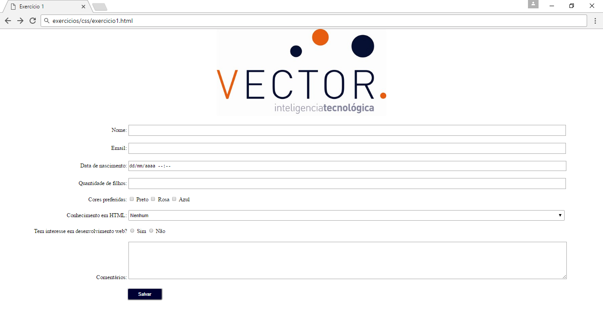
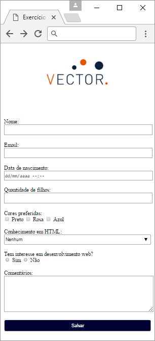
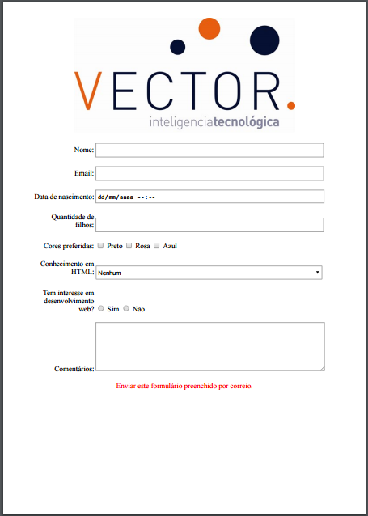

# Exercício 1

> Utilizar o formulário usado para o exercício de HTML.

Estilizar o formulário produzido no módulo de HTML para atender as regras abaixo:

## Corpo

* Margem de 30px na esquerda e direita
* Margem de 0 nos demais lados, cima e baixo

## Logo

* Largura de 480px, centralizada

## Campos

* Espaçamento de 20px entre eles
* Ocupar 75% da tela, à direita do seu nome
* Múltiplos campos de marcação, como `checkbox` e `radio` devem estar alinhados na mesma linha
* 25px de altura. **Exceto o campo *Comentários*, tendo 100px**
* Nome dos campos devem estar à esquerda, ocupando 20% da tela e alinhados à direita
* Ao clicar no nome, deve focar o campo

## Botão

* Largura de 100px
* Altura de 35px
* Borda arredondada de 5px
* Cor de fundo com o código RGB: `rgb(0,0,50)`
* Texto deve ser branco

## Regras para telas menores de 480px

### Corpo

* Margem de 10px na esquerda e direita

### Logo

* Largura de 200px

### Campos

* Nomes e campos devem ocupar toda a tela, horizontalmente, em linhas separadas
* Nomes dos campos alinhados à esquerda
* Botão:
* Deve ocupar toda a tela, horizontalmente

## Regras para caso a página seja impressa:

* Botão *Salvar* não deve aparacer
* Aviso, em vermelho, no final da página com a mensage: *Enviar este formulário preenchido por correio.*

## Exemplos

Resultado final em telas maiores de 480px:

Resultado final em telas menores de 480px:

Resultado final ao imprimir:

Resultado final ao imprimir com maior escala:

