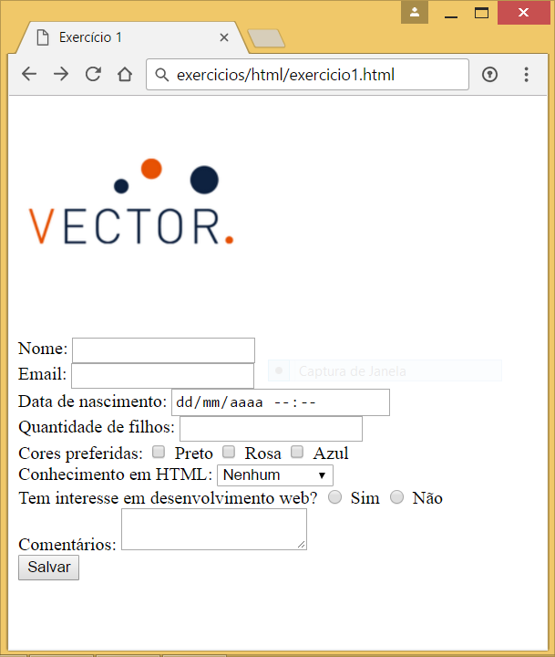

# Exercício 1

Criar formulário para pesquisa de conhecimento.

Todos os campos devem:

- Ter um elemento indicando o nome do campo *(label)*
- Indicação no campo antes de iniciar digitação *(placeholder)*

Campos do formulário:

> Todos os campos devem ter um elemento acima dele indicando o seu nome *(label)* e um placeholder.
> Os campos também devem usar os elementos HTML referentes ao tipo do dado.

- Título com nome *"Treinamento Angular - Vector"*
- Logo da Vector (deve direcionar para a página *<https://www.vectoritcgroup.com>* ao ser clica)
  - Logo menor em telas com até 480px
- Nome
- Email
- Data de nascimento
- Quantidade de filhos
- Cores preferidas *usando `checkbox`*
  - Preto
  - Rosa
  - Azul
- Conhecimento em HTML *usando `select`*
  - Nenhum
  - Básico
  - Intermediário
  - Avançado
- Tem interesse em desenvolvimento web *usando `radio`*
  - Sim
  - Não
- Comentários *campo de texto livre*

Botão *Salvar* deve enviar os dados para o email *<wbarbosa@vectoritcgroup.com>*.

Exemplo do resultado final:

